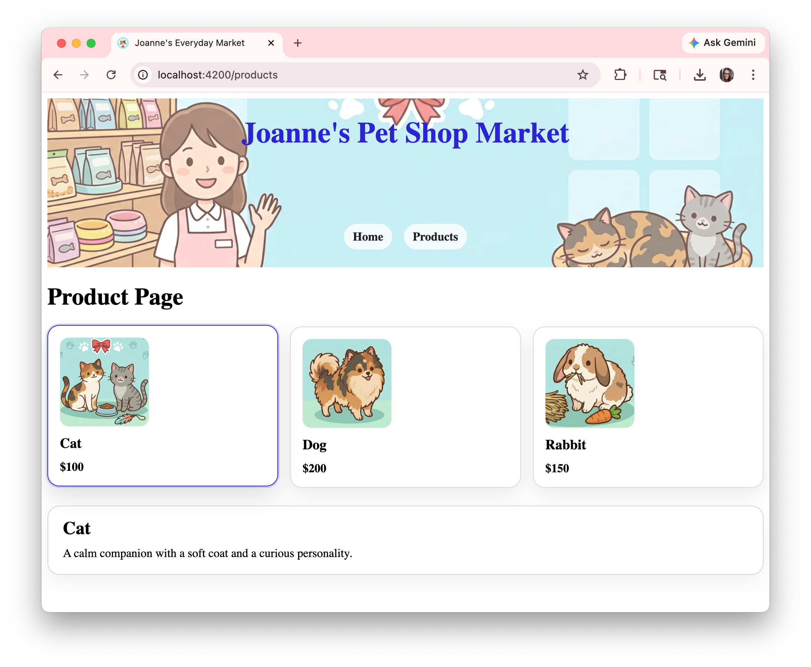

# Joanne Market Ng

joanne-market-ng is a simple Angular storefront project created to practice core front-end concepts including standalone components, routing, parent-child communication, and event-based interaction between components.

The app includes a home page, a product page with selectable product cards, and a shared header. Product images are loaded from the public assets folder, and selecting a product updates the parent page with additional product details.

Built with Angular 21.

## Screenshot



## Project Notes

- Created by Joanne for demonstration of front-end concepts.
- Gemini and ChatGPT 5.4 were used to help with some images, styles, and code syntax.

## Run Locally

Start the development server:

```bash
ng serve
```

Then open `http://localhost:4200/` in your browser.

## Build

Create a production build:

```bash
ng build
```

## Test

Run the unit tests:

```bash
ng test
```

## Testing Notes

Tested prior to submission.

Test steps performed:

- Opened the app and verified the header, home page, and product page render.
- Clicked product cards and confirmed the selected card styling updates.
- Confirmed the selected product description appears on the Products page.
- Verified product images load correctly.

Commands and tools used:

- `ng serve`
- `ng lint`
- `ng test --watch=false`
- Browser developer tools
